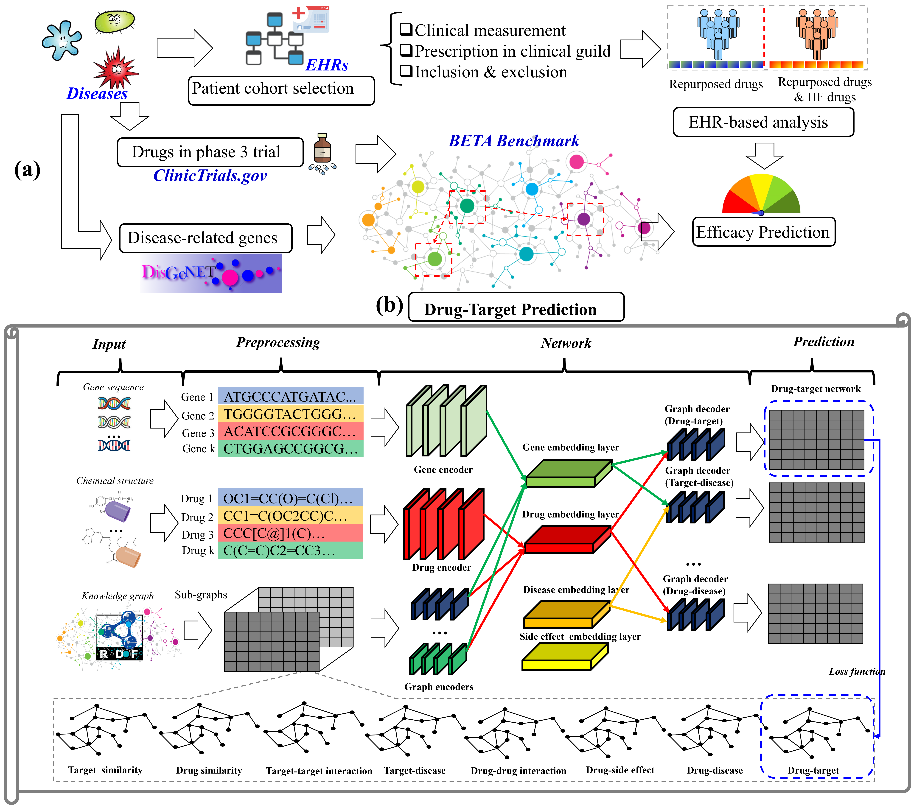

<table border='1' align="center">
<tr>

</tr>
</table>

# Objective:   
Our study presents a comprehensive framework for predicting drug efficacy in phase 3 trials, which combines drug-target prediction using biomedical knowledgebases with statistical analysis of real-world data. In this Github page, we provide the source-code for the drug-target prediction [see our pre-print paper for details] (https://github.com/bioIKEA/IKEA_BETA_Benchmark#readme). 

# Data:
We use [BETA] (https://github.com/bioIKEA/IKEA_BETA_Benchmark#readme), which provides a large-scale benchmark that enables a comprehensive evaluation of the drug-target predictive models to facilitate a better selection of computational strategies for pre-screening. This benchmark functions are:

1. an extensive multiple-partite network (e.g., 0.95 million biomedical concepts including 59 thousand drugs and 75 thousand targets, and 2.5 million associations including 817 thousand drug-target associations) as well as drug-drug and protein-protein similarities based on drug chemical structures and gene sequences
2. a way of comprehensively evaluating strategies that reflect diverse scenarios (a total 1300 tasks across two types of training/testing sampling strategies based on drug-target space as well as five types of validation strategies).

<table border='1' align="center">
<tr>

</tr>
</table>
  
# How to use

## Downlaod the latest benchmark
Simply ran the code:
   - complex_model/model/src/DT_Prediction.py

## Citation

		

# Contact
For help or questions of using the application, please contact Zong.nansu@mayo.edu
